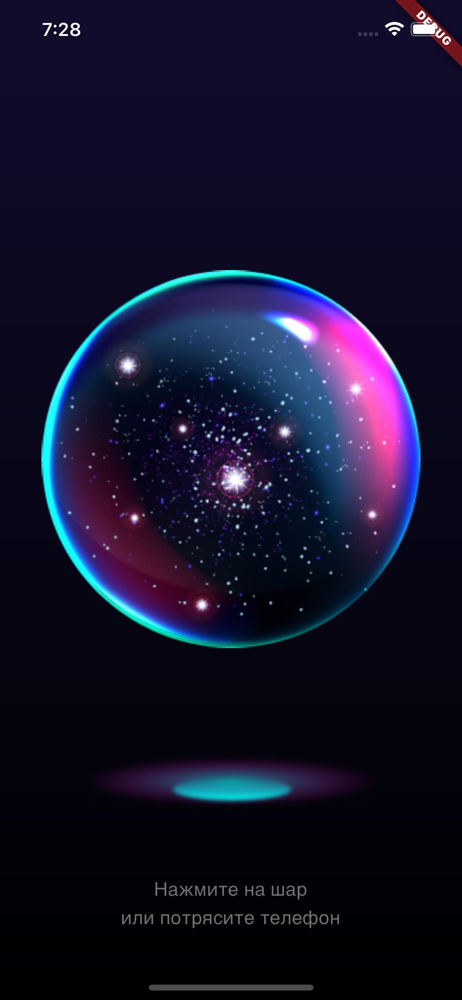
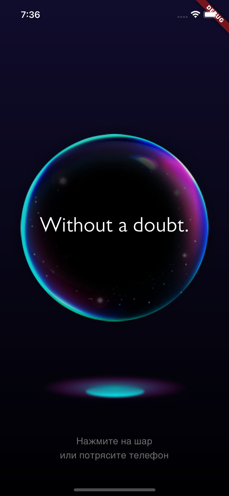
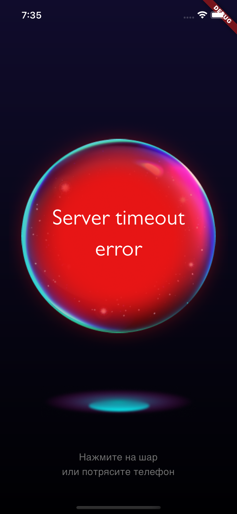
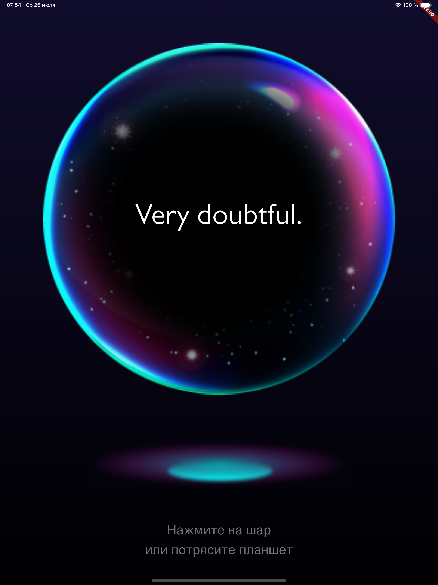
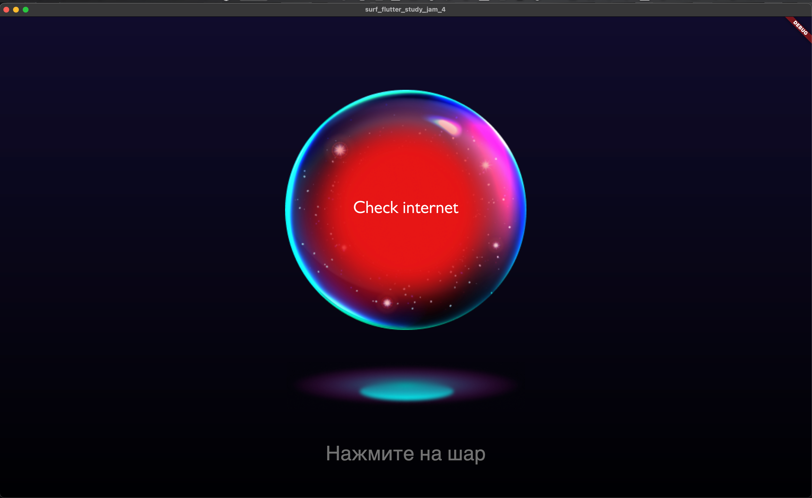

# Surf Flutter Study Jam 4

## Текущее состояние приложения

- Версия Flutter: **3.13.0**
- Версия Dart: **3.1.0**

### Задание 1

> Реализуйте интерфейс экрана с магическим шаром.

### Задание 2

> Реализуйте бизнес-логику нажатия на шар для получения ответа. Используйте мок-данные для > отображения.

Архитектура приложения построена на принципах Clean Architecture, layer-first.

Для управления состоянием использован пакет [Riverpod](https://pub.dev/packages/riverpod), StateProvider хранит текущее состояние (normal, wait, result, error), а StateNotifier хранит ответ полученный по API. Стейт отделён от логики отдельным провайдером.

### Задание 3

> Добавьте логику для обработки пользовательского вопроса и получения ответа от API.

Дабавлен слой data. Созданы классы для имлетации, разделена логика и данные с помощью репозитория. Настроены зависимости. Настроены обработки ошибок. Добавлен пакет [http](https://pub.dev/packages/http), 

### Задание 4

> Реализуйте отправку запроса при тряске телефона.

Для отслеживания использован пакет [shake](https://pub.dev/packages/shake).

### Задание 5

> Адаптируйте приложения для запуска на десктоп/веб-платформах, а также планшетах. 

Адаптация реализована с помощью LayoutBuilder.

----------
Спасибо за очередной `Study Jam`.

Интересное задание, творческое. Но зачем же в будний день устраивать. У меня например, начальник второй день как из отпуска вышел, тут либо либо. 